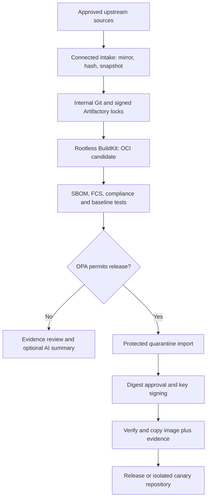

# Image Hardening Factory

Rebuild pinned Iron Bank UBI and Atlassian sources with Jenkins, rootless
BuildKit, and internal Artifactory repositories. The factory produces OCI images,
SBOMs, assessment evidence, and key-signed release artifacts. It does not deploy
applications or confer a STIG/FedRAMP compliance designation.

**Status: integration reference implementation.** Local validation runs without
registries. Production requires configured Jenkins trust classes, immutable RPM
snapshots, tool images, signing keys, and licensed product test environments.
The build path is internal-only. Enabled and configured CrowdStrike FCS requires
the selected Falcon API; otherwise the gate uses offline Syft/Grype. See [implementation status](docs/implementation-status.md).

## Start here

```bash
python3 -m venv .venv
. .venv/bin/activate
pip install -e '.[dev]'
make validate
make test
make lint
make plan
```

In an offline environment, install from your approved wheelhouse with
`pip install --no-index --find-links /path/to/wheels -e '.[dev]'`.
For a packaged installation, install the factory wheel and its dependencies;
the catalog schema is included in the wheel.

`make plan` writes `generated-jenkins-plan.json`; it does not build or publish.
Run `make policy-test` with OPA installed to test the release rules.

For a disposable connected development build, install the prerequisites in
[local development](docs/local-development.md), then run:

```bash
make local-build IMAGE=ubi9-minimal LOCAL_USE_UPSTREAM_UBI_REPOS=true
```

Every local build is marked development-only and rejected by quarantine import.
Source pins describe reviewed baselines, not a claim to track the latest release.

## Image catalog

| Image | Baseline version | Parent | Track |
|---|---|---|---|
| UBI 9 Minimal | 9.8 | Locked upstream UBI | Release |
| UBI 10 Minimal | 10.2 | Locked upstream UBI | Canary |
| Bitbucket LTS | 10.2.7 | Internal UBI 9 | Release |
| Confluence LTS | 10.2.18 | Internal UBI 9 | Release |
| Jira LTS | 11.3.11 | Internal UBI 9 | Release |

A UBI 9 change selects all three applications. A UBI 10 change selects only
UBI 10. Selecting one application reuses its released base unless that base is
also selected. Only one platform per catalog entry is currently implemented.

## Process and trust boundaries



FCS is preferred when enabled and configured; otherwise Syft/Grype supplies the
scanner assessment using catalog thresholds. The optional legacy SCAN stage is
informational; OpenSCAP, baseline tests, and required evidence also block release.
Catalog vulnerability thresholds and exception records do **not** override the
Falcon tenant assessment policy. See [evidence model](docs/evidence-model.md).

Build jobs have no publication credentials. Protected jobs must load trusted
pipeline code and use separately scoped credentials; a branch check in a
Jenkinsfile is not a credential boundary. Gov approval identifies the candidate
digest after evidence is available. Membership in a governed identity group,
not an email suffix alone, establishes approval eligibility.

Promotion preserves the digest, copies OCI referrers with ORAS, and copies
Cosign 2.x digest-tagged attachments explicitly. It verifies required signed
evidence before and after copying. Signing uses environment-local encrypted
Cosign keys without public Fulcio/Rekor dependencies.

## Konflux-aligned workflow extensions

The pipeline now includes optional stages that map to patterns used in Konflux
and Project Hummingbird style supply-chain workflows:

- **Helmper concept (`FACTORY_ENABLE_HELMPER`)**: inventory chart inputs as
  evidence from the prepared build context.
- **Copacetic concept (`FACTORY_ENABLE_COPA`)**: run patch-planning commands
  using the candidate image, SBOM, and findings as inputs.
- **Hummingbird concept (`FACTORY_ENABLE_HUMMINGBIRD`)**: produce
  reproducibility-focused evidence summarizing digest, provenance, SBOM hashes,
  and gate/FCS outcomes.

Each concept stage is disabled by default and executes only when explicitly
enabled and configured.

## Choose your guide

| Goal | Guide |
|---|---|
| Understand architecture and dependency flow | [Architecture](docs/architecture.md) |
| Build or troubleshoot on a workstation | [Local development](docs/local-development.md) |
| Bind Jenkins settings and credentials | [Configuration reference](docs/configuration.md) |
| Bootstrap and operate production | [Operations and Day 2](docs/operations.md) |
| Understand evidence and limitations | [Evidence model](docs/evidence-model.md) |
| Assess readiness and remaining work | [Implementation status](docs/implementation-status.md) |
| Follow implementation milestones | [Implementation plan](IMPLEMENTATION_PLAN.md) |
| Change code safely | [Contributing](CONTRIBUTING.md) |

## Repository map

| Path | Purpose |
|---|---|
| `Jenkinsfile`, `Jenkinsfile.intake` | Build/release and connected intake orchestration |
| `factory/` | Catalog, packaged JSON Schema, planner, intake and evidence CLI |
| `catalog/images/` | Five pinned image definitions |
| `overlays/` | Reviewed downstream patches applied to pinned upstream sources |
| `scripts/` | Stage executors and workstation workflow |
| `policies/rego/` | OPA release decision and policy tests |
| `tests/` | Python regression tests and product baseline profiles |
| `config/rpm/`, `vendir/` | Intake RPM origins and Git source pins |
| `toolchain/`, `tools/`, `security-data/` | Runner build inputs and tool/data inventory |
| `agents/` | Read-only analysis prompt and remediation output schema |
| `docs/` | Operator guides; historical presentation retained as a reference |

`work/`, `dist/`, downloaded vendor files, OCI archives, and generated plans are
build outputs. Do not commit them. No license is assigned to factory code;
confirm distribution terms with the repository owner before redistribution.

See the [harness remediation plan](docs/reviews/harness-remediation-plan.md) for
scanner selection details and [Rancher Desktop setup](docs/local-kubernetes-testing.md).
