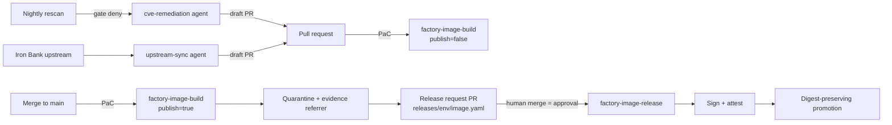

# Image Hardening Factory

Image Hardening Factory rebuilds the Iron Bank **Bitbucket, Jira, and Confluence
Data Center LTS** images (`bitbucket-lts`, `jira-lts`, `confluence-lts`) on an
internal hardened UBI 9 base and produces, for every candidate:

- a digest-pinned OCI image built rootless from signed, locked inputs
- CycloneDX and SPDX SBOMs
- vulnerability, malware, OpenSCAP compliance, and product-test evidence
- an OPA release decision bound to the candidate digest
- Cosign signatures and in-toto attestations, plus Tekton Chains SLSA provenance

Pipelines run on **Tekton**, triggered by **Pipelines-as-Code** (PaC). Day-to-day
upkeep — failure triage, CVE remediation, Iron Bank upstream tracking, release
briefings, exception hygiene, and pipeline reviews — is assisted by **Claude Code
agents** that can only *propose* changes for human review.

It is a build-and-evidence system, not a deployment platform.


```mermaid
flowchart LR
    PR[Pull request] -->|PaC| Build[factory-image-build<br/>publish=false]
    Main[Merge to main] -->|PaC| BuildP[factory-image-build<br/>publish=true]
    BuildP --> Q[Quarantine + evidence referrer]
    Q --> RR[Release request PR<br/>releases/env/image.yaml]
    RR -->|human merge = approval| Rel[factory-image-release]
    Rel --> Sign[Sign + attest] --> Promote[Digest-preserving promotion]
    Nightly[Nightly rescan] -->|gate deny| Rem[cve-remediation agent] -->|draft PR| PR
    Up[Iron Bank upstream] --> Sync[upstream-sync agent] -->|draft PR| PR
```

## New here? Start in 10 minutes

Day-one needs Python 3.11+ and git. The only other host software is for the
optional local cluster: a container runtime (Podman or Docker), `kind`, and
`kubectl`. There is no host-side build toolchain to install; builds run inside
the same runner image and Tekton Task the pipeline uses.

```bash
python3 -m venv .venv && . .venv/bin/activate
pip install -e '.[dev]'
make ci          # validate, tekton-check, release-requests, lint, test (+ opa if present)
make agents      # list the agent personas
```

To build an image for real on a disposable local cluster (about 15 minutes the
first time; needs `kind` at the version in `tools/versions.lock.yaml`):

```bash
make harness-up                  # kind cluster, runner image, Tekton, factory objects
make harness-run IMAGE=ubi9-minimal   # rootless build, SBOM, tests, seal checks
make harness-down
```

Harness builds use Red Hat's public UBI content and an unsigned lock, so they
can never be imported, signed, or promoted. See
[docs/local-kubernetes-testing.md](docs/local-kubernetes-testing.md).

### Work with the agents interactively

Open the repository in Claude Code. `CLAUDE.md`, the personas in
`.claude/agents/`, the skills in `.claude/skills/`, and the guard hooks in
`.claude/settings.json` load automatically. For example: *"use the
upstream-sync agent to explain what changed upstream for jira-lts"*.

## How a change flows

1. **Pull request** — PaC runs `factory-checks` and, for each image whose inputs
   changed, `<image>-on-pull-request`: validate → prepare → rootless build → SBOM →
   scan/assessment → compliance (FIPS nodes) + tests → gate. Nothing is published.
   Failures get a triage comment from the `failure-triage` agent.
2. **Merge to `main`** — `<image>-on-push` repeats the build, imports the passing
   candidate into quarantine, attaches its evidence bundle as an OCI referrer, and
   opens a **release request** change (`releases/<env>/<image>.yaml`) with a
   readiness briefing from the `release-readiness` agent.
3. **Release** — merging the release request (CODEOWNERS-reviewed; the merger is
   the approver of record) runs `factory-image-release`: verify evidence → sign and
   attest with the environment key → promote by digest → publish the base release
   pointer → rebuild dependents if a base changed.
4. **Every night** — each image is re-gated against fresh vulnerability data. A
   deny hands off to the `cve-remediation` agent, which opens a draft fix.

## Repository map

| Path | Purpose |
|---|---|
| `catalog/images/` | What to build and its policy (schema in `factory/schemas/`) |
| `overlays/<image>/patches/` | Factory patches applied on top of the Iron Bank source |
| `.tekton/tasks/`, `.tekton/pipelines/` | Tekton Tasks and Pipelines |
| `.tekton/*-on-*.yaml` | Generated PaC PipelineRuns (`make tekton-render`) |
| `deploy/` | Namespace, ServiceAccounts, NetworkPolicies, Repository CR, schedules, admission policy, Chains config |
| `toolchain/` | Runner image Containerfiles and the pinned-tool downloader (`make toolchain`) |
| `releases/` | Release requests; merging one signs and promotes |
| `.claude/` | Agent personas, skills, settings, and hooks for Claude Code |
| `agents/` | CI agent settings and output schemas |
| `factory/` | Python: catalog, planning, findings, gate input, Tekton rendering, agents, release requests |
| `scripts/` | Stage scripts; `scripts/tekton/` runtime helpers; `scripts/agents/` agent plumbing |
| `policies/` | OPA release policy and approved exceptions |
| `tests/` | Unit tests, product test profiles, and the kind Tekton harness |

## Documentation

- [Architecture](docs/architecture.md) — triggers, pipelines, trust classes, sealing, release flow
- [AI agents](docs/agents.md) — personas, isolation model, guardrails, operations
- [Configuration](docs/configuration.md) — cluster install, settings, secrets, Repository CR
- [Operations](docs/operations.md) — bootstrap, release process, day-2 cadence, runbooks
- [Evidence model](docs/evidence-model.md) — what is produced, signed, and verified
- [Migration from Jenkins](docs/migration-from-jenkins.md) — concept mapping
- [Local cluster harness](docs/local-kubernetes-testing.md) — build an image end to end on kind
- [Implementation status](docs/implementation-status.md)

## Notes and expectations

- This is an integration reference implementation that evolves actively.
- Production use needs environment-specific clusters, credentials, signing keys,
  repositories, network policy endpoints, and an approved LLM gateway.
- Never commit generated outputs (`work/`, OCI archives, proprietary binaries)
  or credentials.
