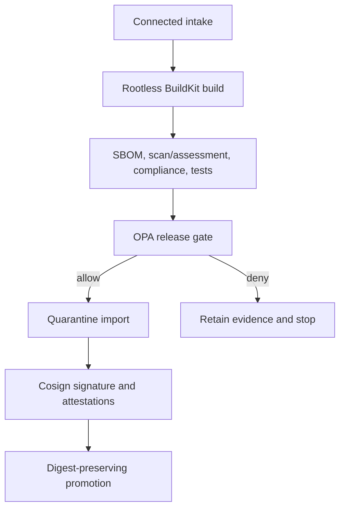
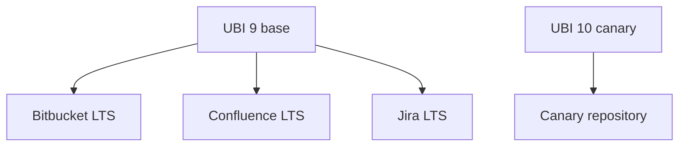

# Architecture

[Project overview](../README.md) · [Configuration](configuration.md) · [Operations](operations.md)

## Quick architecture view

### What this system does

Image Hardening Factory takes pinned source inputs, builds deterministic OCI
candidates, gathers evidence, gates release with policy, then signs/promotes by
digest.

### High-level flow

### Image dependency model

A base change can fan out to dependent application images; a single application
build can reuse an already-released base when that base is not selected.

---

## Advanced architecture reference

### Trust boundaries by stage

| Boundary | Inputs | Outputs | Privilege |
|---|---|---|---|
| Connected intake | Pinned source + manifests | Signed resource locks + mirrored artifacts | Upstream access + intake write |
| Prepare/build | Internal mirrors + selected base | OCI archive + build metadata | Internal read; rootless namespaces |
| Evidence/assessment | Candidate archive | Findings, assessment status, compliance/test evidence | Internal analysis only |
| Policy gate | Required evidence set | allow/deny decision | No publish credential |
| Import | Passing digest + lock | Immutable quarantine ref | Quarantine write |
| Signing | Imported digest + evidence | Signature + attestations | Signing/referrer write |
| Promotion | Signed quarantine digest | Exact digest in release/canary | Source read + destination write |

### Assessment and policy model

The authoritative backend is **delegated-scanners** with normalized evidence
from scanner outputs and policy-aware assessment status. Policy still evaluates:

- SBOM validity
- assessment integrity and digest match
- compliance and test pass state
- vulnerability threshold rules and approved exceptions

Warnings (for selected outside-archive fixable findings) do not bypass deny
conditions for in-scope blocking findings.

### Build/runtime model

- BuildKit runs rootless per-job with native snapshotter.
- Podman remains rootless with VFS for scan/test workflows.
- Scanner and compliance rootfs inspection uses ownership-preserving Umoci
  unpack under `podman unshare`.
- No shared privileged daemon is required.

### Evidence identity and promotion

Evidence is bound to the candidate digest via signed attestations. Promotion is
pull-based and must preserve digest identity while copying both referrers and
Cosign attachment artifacts.

### Konflux-style optional stages

Helmper, Copacetic, and Hummingbird stages remain optional evidence extensions.
They add analysis/reproducibility data without weakening trust boundaries.
