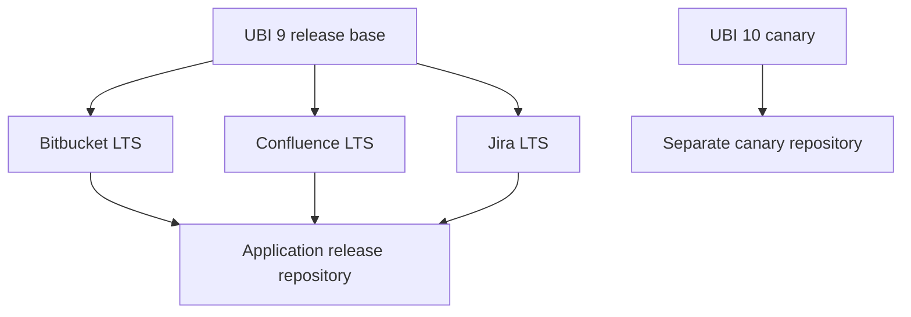
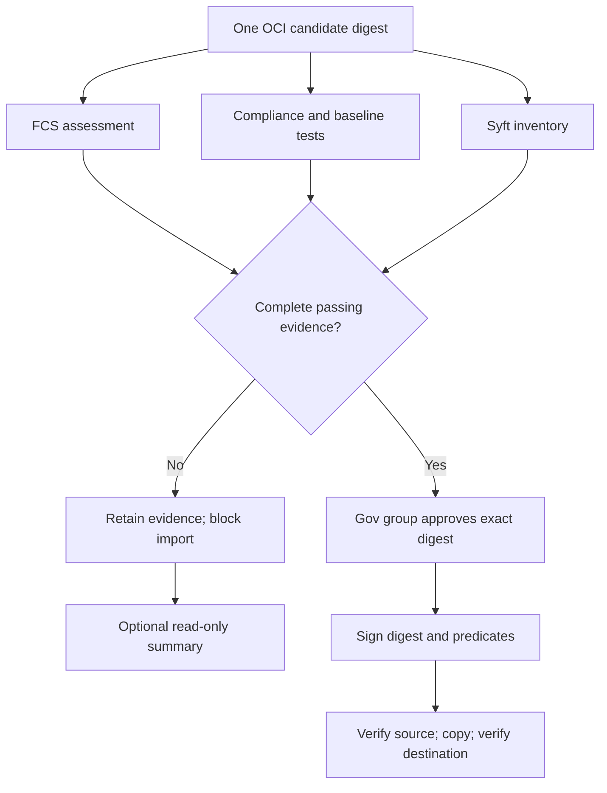

# Architecture

## Dependency selection

The planner computes descendants and schedules dependency waves. Selected bases
pass their OCI archive directly to dependent builds. Unselected bases currently
require an operator-maintained `releases/<base>/current.json` in the generic
source repository, with an internal digest-qualified `imageRef`. The factory
does not publish this index automatically. Restrict its writer to the release
operator; it is a trust input and is not independently signed by this implementation.

## Stage ownership

| Boundary | Inputs | Outputs | Privilege |
|---|---|---|---|
| Connected intake | Pinned source, manifest resources, RPM origins | Mirrors, signed resource locks and snapshot metadata | Upstream access; intake writes |
| Prepare/build | Internal inputs and selected base | OCI archive, metadata | Internal reads; rootless user namespaces |
| Assessment | Exact candidate archive | FCS, SBOM, OpenSCAP and baseline results | FCS API access only in FCS pod |
| Policy | Required assessment evidence | Allow/deny document | No publication credential |
| Import | Passing candidate and lock | Immutable quarantine reference | Quarantine writes |
| Sign | Imported digest, evidence, Gov approval | Cosign signature and attestations | Key and attachment writes |
| Promote | Signed candidate and attachments | Exact digest in release/canary | Source read, destination write |

Jenkins stashes transfer candidates between pods. An external Artifact Manager
is required at realistic image sizes. Rootless does not mean every Kubernetes
Restricted profile works unchanged: validate user namespaces, subordinate IDs,
setuid mapping helpers, seccomp and storage on the actual node/runtime pair.
Never solve runtime incompatibility by granting a general-purpose privileged pod.

## Evidence and failure flow

The gate command exits nonzero on denial. Jenkins records it as an unstable
stage so optional remediation can inspect evidence; the importer independently
rejects denial. Failures before the gate (such as a runtime test error) stop the
image pipeline. There is no automatic exception or AI override.

## Storage compatibility

The recorded Cosign 2.6 baseline uses digest-derived attachment tags. OCI 1.1
registry support alone does not convert those tags into referrers. Promotion
therefore uses both ORAS recursive copying and `cosign copy --only=sig,att,sbom`,
then validates required attestations at the destination. Do not change Cosign
major versions without a signed-image integration test against your Artifactory.

Relevant upstream interfaces:

- [Skopeo copy and digest preservation](https://github.com/containers/skopeo/blob/main/docs/skopeo-copy.1.md)
- [Cosign 2.6 copy command](https://github.com/sigstore/cosign/blob/v2.6.0/cmd/cosign/cli/copy.go)
- [ORAS recursive copy](https://oras.land/docs/commands/oras_cp/)
- [OPA policy language](https://www.openpolicyagent.org/docs/policy-language)

## Konflux workflow alignment

The optional Helmper, Copacetic, and Hummingbird stages follow the same
high-level separation used by Konflux pipelines:

- Build and evidence stages produce immutable digest-linked artifacts.
- Policy remains explicit and independent from remediation planning.
- Remediation and reproducibility checks are additive evidence and can be run as
  informative stages without granting publish credentials.

This keeps trust boundaries stable while allowing operators to adopt
Konflux-style task bundles incrementally.

These diagrams are Markdown/Mermaid source for GitHub. For Confluence instances
without Mermaid support, render to SVG/PNG and attach the image; a Markdown code
block is not a native Confluence diagram. The retained introduction PPTX is a
historical overview, not the authoritative configuration reference.
