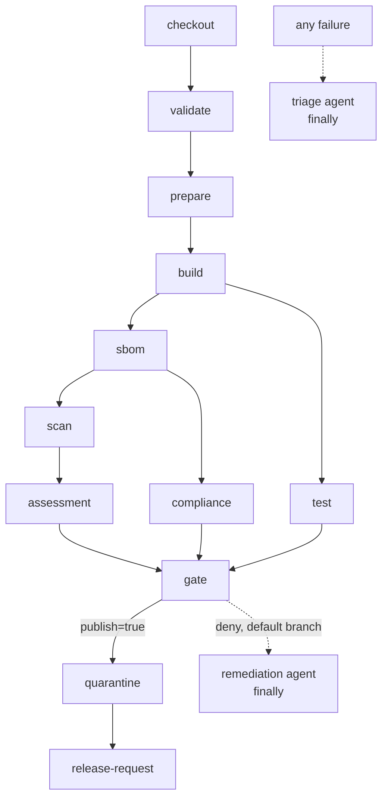
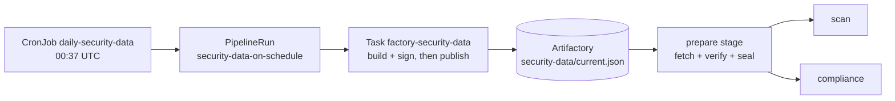
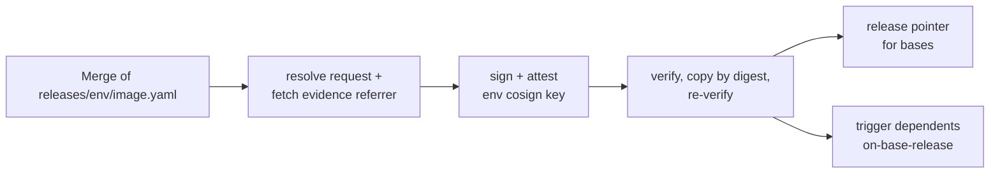
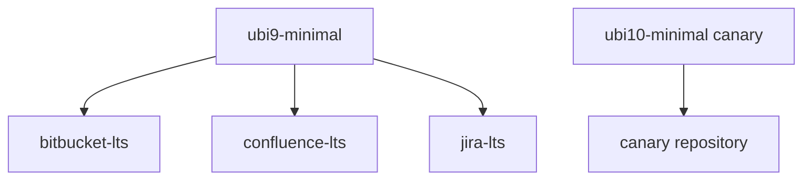

# Architecture

[Project overview](../README.md) · [Agents](agents.md) · [Configuration](configuration.md) · [Operations](operations.md) · [Evidence model](evidence-model.md)

## What this system does

The factory takes pinned Iron Bank source repositories, rebuilds each image
without root privileges, collects evidence about the result, and decides with a
policy whether the image may be released. Released images are signed and copied
by digest, so the bytes never change after the decision.

- Pipelines run on [Tekton](https://tekton.dev/docs/pipelines/).
- [Pipelines-as-Code](https://pipelinesascode.com/docs/) (PaC) starts those
  pipelines from Git events and webhooks.
- The release decision is made by [Open Policy Agent](https://www.openpolicyagent.org/docs/)
  (OPA).
- Claude Code agents help with operations. They cannot publish, sign, approve,
  or merge anything.

Terms used below:

- **Candidate** — one built image, identified by its OCI (Open Container
  Initiative) image digest (`sha256:...`).
- **Evidence** — files that describe a candidate: SBOMs (software bills of
  materials), scanner reports, compliance and test results, and the gate result.
- **Gate** — the OPA policy check that allows or denies release of a candidate.

## Triggers

Every trigger is a PipelineRun file in `.tekton/`, generated from the catalog by
`factory/tekton.py` (`make tekton-render`). PaC reads these files **only from the
default branch** (`pipelinerun_provenance: default_branch`, see the PaC
[Repository CR guide](https://pipelinesascode.com/docs/guides/repository-crd/)).
A pull request therefore cannot add or edit a trigger to reach protected
credentials.

| PipelineRun | Started by | Pipeline | Publishes |
|---|---|---|---|
| `<image>-on-pull-request` | PR touching that image's catalog entry, overlays, test profile, or shared build code | `factory-image-build` | no |
| `<image>-on-push` | the same paths merged to `main` | `factory-image-build` | quarantine + release request |
| `<image>-on-schedule` | nightly CronJob | `factory-image-build` | no (re-gate only; a deny hands off to the remediation agent) |
| `<image>-on-base-release` | release pipeline, after the image's base was promoted (application images only) | `factory-image-build` | quarantine + release request |
| `factory-checks-on-pull-request` | every PR | `factory-checks` | no |
| `release-on-push` | merge touching `releases/**` | `factory-image-release` | sign + promote |
| `intake-on-schedule` | weekday CronJob | `factory-intake` | signed resource locks |
| `security-data-on-schedule` | daily CronJob | `factory-security-data` | signed security-data bundle |
| `agent-upstream-sync-on-schedule` | weekday CronJob | `factory-agent-maintenance` | draft PR |
| `agent-exception-steward-on-schedule` | weekly CronJob | `factory-agent-maintenance` | draft PR |
| `agent-pipeline-review-on-pull-request` / `-on-comment` | PR touching trust-boundary paths, or a `/review` comment | `factory-agent-maintenance` | PR comment |

`<image>` is each of the five catalog images: `ubi9-minimal`, `ubi10-minimal`,
`bitbucket-lts`, `confluence-lts`, and `jira-lts`.

Scheduled runs are started by Kubernetes CronJobs in `deploy/base/schedules.yaml`.
Each CronJob calls the PaC
[incoming webhook](https://pipelinesascode.com/docs/advanced/incoming-webhooks/)
with the name of the PipelineRun to start. See [operations.md](operations.md#day-2-cadence)
for the times.

## Build pipeline

```mermaid
flowchart TD
    checkout --> validate --> prepare --> build
    build --> sbom --> scan --> assessment
    build --> test
    sbom --> compliance
    assessment --> gate
    compliance --> gate
    test --> gate
    gate -->|publish=true| quarantine --> release-request
    gate -. deny, default branch .-> remediation[remediation agent<br/>finally]
    any[any failure] -.-> triage[triage agent<br/>finally]
```

| Stage | What it does |
|---|---|
| validate | checks the catalog and the image definition |
| prepare | applies overlay patches to the Iron Bank source, checks the signed resource lock, and downloads and verifies the [security-data bundle](#offline-security-data) |
| build | rootless BuildKit build of the OCI archive |
| sbom | Syft CycloneDX and SPDX SBOMs, plus `sbom.identity.json` (the digest they describe and their hashes) |
| scan | Grype, Trivy, OSV-Scanner, and ClamAV; writes normalized findings and the assessment status (see [evidence-model.md](evidence-model.md#how-the-scan-stage-works)) |
| assessment | fails unless the scan stage wrote an assessment status file |
| compliance | OpenSCAP STIG scan on FIPS-labelled nodes |
| test | product tests and RPM integrity checks in rootless Podman |
| gate | builds the gate input and evaluates the OPA release policy |
| quarantine | imports the candidate into the quarantine repository and attaches its evidence (`publish=true` only) |
| release-request | opens the release request change with the `release-readiness` agent's briefing |

The scan stage may fail without failing its Tekton task (`allow-failure: "true"`).
This keeps its evidence for the agents. The assessment stage then fails when no
assessment was written, so a broken scan still stops the run. The gate fails the
PipelineRun on deny. The build pipeline never signs or promotes.

Two agents run in the pipeline's `finally` section, which
[Tekton runs after all other tasks, whether they passed or failed](https://github.com/tektoncd/pipeline/blob/v1.15.0/docs/pipelines.md#adding-finally-to-the-pipeline):
`failure-triage` when any task failed, and `cve-remediation` when the gate task
failed on a default-branch or scheduled run.

## Offline security data

Scan and compliance stages have no internet access. They read a signed bundle
of scanner databases, the CISA (Cybersecurity and Infrastructure Security
Agency) KEV (Known Exploited Vulnerabilities) catalog, ClamAV signatures, and
SCAP (Security Content Automation Protocol) content.

```mermaid
flowchart LR
    cron[CronJob daily-security-data<br/>00:37 UTC] --> run[PipelineRun<br/>security-data-on-schedule]
    run --> task[Task factory-security-data<br/>build + sign, then publish]
    task --> art[(Artifactory<br/>security-data/current.json)]
    art --> prepare[prepare stage<br/>fetch + verify + seal]
    prepare --> scan[scan]
    prepare --> compliance[compliance]
```

1. The `factory-security-data` Task runs in the intake permission group. Its
   build step runs `scripts/build_security_bundle.sh` and signs the bundle with
   the intake cosign key. Its publish step runs `scripts/publish_security_bundle.sh`,
   which uploads the bundle and then moves the `security-data/current.json`
   pointer to it.
2. Each image build's prepare stage runs `scripts/fetch_security_bundle.sh`. It
   checks the bundle's SHA-256 against the pointer, verifies the cosign
   signature with the intake public key, unpacks the bundle into
   `work/<image>/security-data/`, and checks every file against the bundle's
   own manifest.
3. Prepare seals the unpacked bundle separately, under the name `security-data`.
   Scan and compliance verify that seal before they read any data.

The bundle contents and freshness rules are in
[security-data/README.md](../security-data/README.md).

## Release pipeline

```mermaid
flowchart LR
    merge[Merge of releases/env/image.yaml] --> resolve[resolve request +<br/>fetch evidence referrer]
    resolve --> attest[sign + attest<br/>env cosign key]
    attest --> promote[verify, copy by digest,<br/>re-verify]
    promote --> pointer[release pointer<br/>for bases]
    promote --> dependents[trigger dependents<br/>on-base-release]
```

The release request pins three values: the candidate digest, the evidence
bundle's manifest digest, and the bundle's SHA-256. `scripts/fetch_evidence_bundle.sh`
refuses evidence that is not attached to that digest or whose bytes differ.
The release pipeline therefore signs exactly the evidence the gate evaluated.

Before and after copying, `scripts/promote_image.sh` runs
`scripts/verify_release_evidence.sh`. That check requires one signed, approving
gate attestation and a signed `delegated-scanners` decision with
`assessmentPassed: true` for the same digest. It rejects any other scanner
backend.

## Trust classes

A **trust class** is a group of pipeline tasks that share the same permissions:
one Kubernetes ServiceAccount, one set of NetworkPolicy egress rules, and the
same allowed secrets. The generated PipelineRuns assign each task its
ServiceAccount through
[`taskRunSpecs`](https://github.com/tektoncd/pipeline/blob/v1.15.0/docs/pipelineruns.md#specifying-taskrunspecs).
NetworkPolicies select pods by their `tekton.dev/pipelineTask` label. A secret
is mounted only into the one step that uses it.

| Class | Pipeline tasks | Secrets | Egress |
|---|---|---|---|
| offline | checkout, validate, sbom, scan, assessment, compliance, gate, dependents | none, except the PaC incoming secret in the dependents step | git host (checkout); PaC controller (dependents) |
| internal-read | prepare, resolve, evidence-context | Artifactory read, intake public key | Artifactory, mirrors |
| buildkit / test | build / test | Artifactory read (build) | Artifactory |
| import | quarantine | quarantine write | Artifactory |
| signing | attest | environment cosign key, referrer write | Artifactory |
| promotion | promote | release write, pointer write | Artifactory |
| intake | intake, security-data, upstream-context | intake write and intake signing key (intake, security-data); mirror push (intake) | approved upstreams |
| agent | triage, remediation, release-request, maintenance agent | LLM gateway; SCM bot and PaC token in separate steps | gateway, git host |

`deploy/base/admission-policy.yaml` is a Kubernetes
[ValidatingAdmissionPolicy](https://kubernetes.io/docs/reference/access-authn-authz/validating-admission-policy/).
It rejects any pod created for a `pull_request` event that references a write,
signing, release, mirror, SCM-bot, or incoming-webhook secret. It checks the
pod, after Tekton has filled in every parameter.

## Sealing stage outputs

All tasks in one PipelineRun share one workspace volume, so a later task could
rewrite an earlier task's evidence. Sealing makes that detectable:

1. When a stage finishes, it writes `work/<image>/.seals/<stage>.sha256`, a list
   of the SHA-256 hash of every file it produced. This list is the **seal**.
2. The stage emits the hash of that list as a Tekton
   [result](https://github.com/tektoncd/pipeline/blob/v1.15.0/docs/tasks.md#emitting-results).
   Results are stored in the TaskRun status, which pods cannot change.
3. The first step of every later stage runs `artifacts.sh verify-source` (the
   checkout still matches the commit) and `artifacts.sh verify <stage>=<hash>`
   for each input, before reading anything.

Stages seal their outputs even when they fail, so the agents can read them.
The prepare stage writes two seals: `prepare` (build context and lock) and
`security-data` (the verified bundle, checked only by scan and compliance).

## Signatures and provenance

- **Factory attestations** (`factory-attest`, `scripts/sign_and_attest.sh`): a
  cosign signature plus signed statements (attestations) for the resource lock,
  both SBOMs, build provenance, findings, compliance, tests, the gate result, the
  scanner decision, the raw Grype, Trivy, and OSV reports, and the approval. They
  use the per-environment key.
- **Tekton Chains**: `factory-quarantine` and `factory-promote` emit
  `IMAGE_URL`/`IMAGE_DIGEST` results. Chains reads these
  [type-hinted results](https://github.com/tektoncd/chains/blob/v0.28.0/docs/slsa-provenance.md),
  signs the image, and stores provenance for TaskRuns and PipelineRuns with a key
  only the Chains controller holds. `deploy/chains/chains-config.yaml` selects
  the `slsa/v2alpha3` format, which
  [Chains documents](https://github.com/tektoncd/chains/blob/v0.28.0/docs/config.md)
  as SLSA v1.0 provenance for Tekton `v1` objects. (The similarly named
  `slsa/v1` value is an alias of the older `in-toto` v0.2 format.)

## Build and runtime model

- BuildKit runs rootless in each build step, using the `native` snapshotter
  ([BuildKit rootless mode](https://github.com/moby/buildkit/blob/v0.33.0/docs/rootless.md)).
  Podman runs rootless with VFS storage for scans and tests. The build and test
  pods run in their own user namespace (`hostUsers: false`, set by the
  generated `taskRunSpecs`), and only those two run steps relax
  `allowPrivilegeEscalation`, seccomp/AppArmor, and `procMount`, because
  `newuidmap`/`newgidmap` are setuid programs and nested containers mount their
  own `/proc`. `scripts/runtime_preflight.sh` checks these conditions before the
  build. No step is privileged or uses host namespaces or host paths.
- BuildKit builds with a source policy that denies remote image, HTTP, and Git
  sources. Every input is a digest-verified local OCI layout or a locked file.
- Scanner and compliance stages unpack the image with `umoci` under
  `podman unshare`, which keeps file ownership.

## Image dependency model

```mermaid
flowchart TD
    U9[ubi9-minimal] --> B[bitbucket-lts]
    U9 --> C[confluence-lts]
    U9 --> J[jira-lts]
    U10[ubi10-minimal canary] --> Canary[canary repository]
```

Application builds use the base recorded in the release pointer
(`releases/<base>/current.json`, written by the release pipeline). When a base
is promoted, the release pipeline starts each dependent's
`<image>-on-base-release` run.

## Agents

See [agents.md](agents.md). In short: personas live in `.claude/agents/`. CI
runs them with `claude --bare -p`
([bare mode](https://code.claude.com/docs/en/headless#start-faster-with-bare-mode))
in `dontAsk` permission mode, with turn and budget caps and JSON-Schema-checked
output, in pods that hold only an LLM gateway token. A separate step re-checks
any proposal against a fresh clone of the pinned commit before a bot opens a
draft change request.
