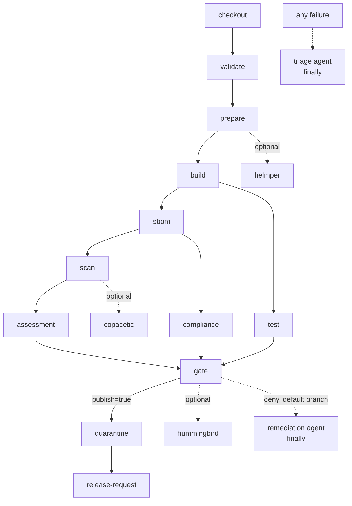
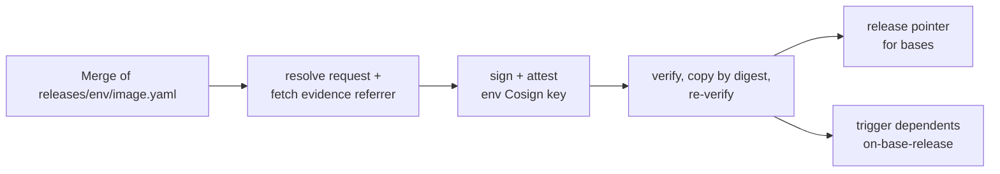
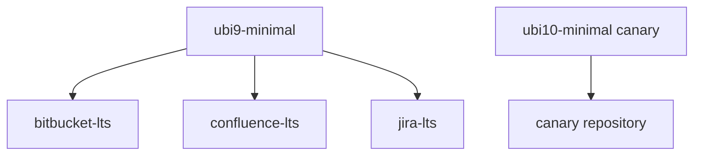

# Architecture

[Project overview](../README.md) · [Agents](agents.md) · [Configuration](configuration.md) · [Operations](operations.md)

## What this system does

The factory takes pinned Iron Bank sources, builds deterministic OCI candidates
rootless, gathers evidence, gates release with OPA, and signs and promotes by
digest — on Tekton, triggered by Pipelines-as-Code. Claude Code agents assist
with operations but cannot publish, sign, approve, or merge.

## Triggers

All triggers are PipelineRuns generated from the catalog by `factory/tekton.py`
(`make tekton-render`). PaC loads them from the **default branch only**
(`pipelinerun_provenance: default_branch`), so a pull request cannot add or edit
a trigger to reach protected credentials.

| PipelineRun | Event | Pipeline | Publishes |
|---|---|---|---|
| `<image>-on-pull-request` | PR touching that image's catalog, overlays, test profile, or shared build code | `factory-image-build` | no |
| `<image>-on-push` | same paths merged to `main` | `factory-image-build` | quarantine + release request |
| `<image>-on-schedule` | nightly incoming webhook | `factory-image-build` | no (re-gate only; deny → remediation agent) |
| `<image>-on-base-release` | incoming webhook after its base was promoted | `factory-image-build` | quarantine + release request |
| `factory-checks-on-pull-request` | every PR | `factory-checks` | no |
| `release-on-push` | merge touching `releases/**` | `factory-image-release` | sign + promote |
| `intake-on-schedule` | incoming webhook | `factory-intake` | signed resource locks |
| `agent-upstream-sync-on-schedule` | incoming webhook | `factory-agent-maintenance` | draft PR |
| `agent-exception-steward-on-schedule` | incoming webhook | `factory-agent-maintenance` | draft PR |
| `agent-pipeline-review-on-pull-request` / `-on-comment` | PR touching trust-boundary paths, or `/review` | `factory-agent-maintenance` | PR comment |

PaC has no cron trigger; `deploy/base/schedules.yaml` CronJobs call its incoming
webhook.

## Build pipeline

```mermaid
flowchart TD
    checkout --> validate --> prepare --> build
    build --> sbom --> scan --> assessment
    build --> test
    sbom --> compliance
    assessment --> gate
    compliance --> gate
    test --> gate
    gate -->|publish=true| quarantine --> release-request
    prepare -.optional.-> helmper
    scan -.optional.-> copacetic
    gate -.optional.-> hummingbird
    gate -. deny, default branch .-> remediation[remediation agent<br/>finally]
    any[any failure] -.-> triage[triage agent<br/>finally]
```

Scan and the optional Konflux-style stages are non-blocking (their evidence is
kept and later stages decide). The gate is blocking and fails the PipelineRun on
deny. Signing and promotion are absent by design.

## Release pipeline

```mermaid
flowchart LR
    merge[Merge of releases/env/image.yaml] --> resolve[resolve request +<br/>fetch evidence referrer]
    resolve --> attest[sign + attest<br/>env Cosign key]
    attest --> promote[verify, copy by digest,<br/>re-verify]
    promote --> pointer[release pointer<br/>for bases]
    promote --> dependents[trigger dependents<br/>on-base-release]
```

The release request pins the candidate digest **and** the evidence bundle's
manifest digest and SHA-256. `fetch_evidence_bundle.sh` refuses evidence that is
not a referrer of that digest or whose bytes differ, so the release pipeline signs
exactly the evidence the gate evaluated.

## Trust classes

Every pipeline task runs with a dedicated ServiceAccount (via `taskRunSpecs`),
is selected by NetworkPolicy through its `tekton.dev/pipelineTask` label, and
receives only its own secrets, mounted into the single step that uses them.

| Class | Pipeline tasks | Secrets | Egress |
|---|---|---|---|
| offline | checkout, validate, sbom, scan, assessment, compliance, gate, optional evidence | none | git host (checkout) |
| internal-read | prepare, resolve, evidence-context | Artifactory read, intake public key | Artifactory, mirrors |
| buildkit / test | build / test | Artifactory read (build) | Artifactory |
| import | quarantine | quarantine write | Artifactory |
| signing | attest | env Cosign key, referrer write | Artifactory |
| promotion | promote | release write, pointer write | Artifactory |
| intake | intake, upstream-context | mirror + intake write (intake only) | approved upstreams |
| agent | triage, remediation, release-request, maintenance agent | LLM gateway; SCM bot and PaC token in separate steps | gateway, git host |

`deploy/base/admission-policy.yaml` rejects any pod created for a
`pull_request` event that references a write, signing, release, mirror, SCM-bot,
or incoming-webhook secret, checked after Tekton resolves parameters.

## Sealing (replacement for Jenkins stash)

Tekton tasks share one workspace volume, so a later task could rewrite an
earlier task's evidence. Each producing task writes
`work/<image>/.seals/<stage>.sha256` and emits the manifest's digest as a Tekton
**result** (stored in TaskRun status, outside any pod's reach). Every consumer's
first step runs `artifacts.sh verify-source` (the checkout still equals the
commit) and `artifacts.sh verify <stage>=<digest>` for each input before reading
anything. Evidence is sealed even when a stage fails, matching the old
"archive in finally" behaviour.

## Signatures and provenance

- **Factory attestations** (`factory-attest`): Cosign signature plus predicates
  for resource lock, SBOMs, SLSA provenance, findings, compliance, tests, gate,
  scanner decision, and approval — with the per-environment key.
- **Tekton Chains**: `factory-quarantine` and `factory-promote` emit
  `IMAGE_URL`/`IMAGE_DIGEST` results; Chains signs those digests and stores SLSA
  v1 provenance for TaskRuns and PipelineRuns with a key only the Chains
  controller holds. The quarantine TaskRun's provenance also records the
  `EVIDENCE_URL`/`EVIDENCE_SHA256` results.

## Build and runtime model

- BuildKit runs rootless per build step with the native snapshotter; Podman
  stays rootless with VFS for scans and tests. Only those two run steps relax
  `allowPrivilegeEscalation` and seccomp/AppArmor (for setuid
  `newuidmap`/`newgidmap`); nothing is privileged or uses host namespaces/paths.
- BuildKit solves with a source policy that denies remote image, HTTP, and Git
  sources; every input is a digest-verified local OCI layout or locked file.
- Scanner and compliance rootfs inspection uses ownership-preserving `umoci`
  unpack under `podman unshare`.

## Image dependency model

```mermaid
flowchart TD
    U9[ubi9-minimal] --> B[bitbucket-lts]
    U9 --> C[confluence-lts]
    U9 --> J[jira-lts]
    U10[ubi10-minimal canary] --> Canary[canary repository]
```

Application builds resolve their base from the released pointer
(`releases/<base>/current.json`, written by the release pipeline). When a base is
promoted, the release pipeline triggers each dependent's
`<image>-on-base-release` run.

## Agents

See [agents.md](agents.md). In short: personas live in `.claude/agents/`, run
headless with `claude --bare -p` under `dontAsk` permissions with turn and budget
caps and schema-validated output, in pods that hold only an LLM gateway token. A
separate step re-validates any proposal from a fresh clone of the pinned commit
before a bot opens a draft change request.
